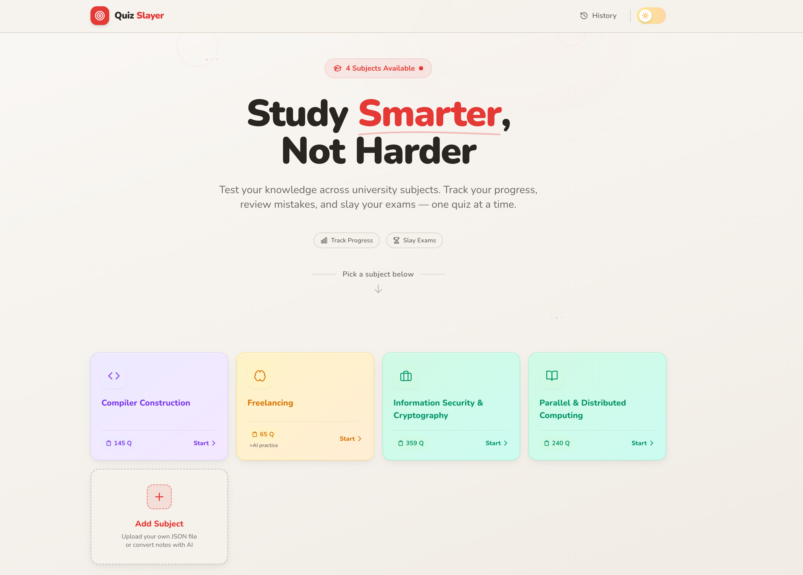

<h1 align="center">Quiz Slayer</h1>

## Tech stack

<p align="left">
	
	
	
	
	
	
</p>


<p align="center">
	
</p>

A React + Vite quiz app for university exam practice.

This README documents **exactly how the current code works** (routes, state flow, persistence, scoring, and custom subject upload).

## What this app does

- Shows built-in and custom quiz subjects on the landing page.
- Lets the user choose:
	- question source (**Professor** questions or **AI Practice** questions, when available), and
	- question count (**All** or **Custom Count**).
- Runs a quiz with per-question navigation and answer tracking.
- Calculates score on submit and saves result history.
- Shows analytics (score summary, breakdown, question-by-question review).
- Supports dark/light theme toggle.
- Supports uploading new subjects via JSON.

## Built-in subjects (from `src/data/*.json`)

- Compiler Construction (`compiler-construction`): 145 `questions`, 0 `guess_questions`
- Freelancing (`freelancing`): 15 `questions`, 50 `guess_questions`
- Information Security & Cryptography (`information-security-cryptography`): 359 `questions`, 0 `guess_questions`

## Run locally

### Requirements

- Node.js 18+
- npm

### Commands

```bash
npm install
npm run dev
```

Other scripts:

```bash
npm run build
npm run preview
npm run lint
```

## Exact route behavior

- `/` → Landing page with subject cards and quiz setup modal.
- `/quiz/:slug` → Active quiz UI.
- `/analytics` → Last completed quiz analytics.
- `/history` → Stored quiz attempts.
- `/upload` → JSON upload for custom subjects.
- Any unknown route (`*`) → redirects to landing UI (renders landing page component).

## Exact quiz lifecycle

### 1) Subject selection and setup

On landing page:

1. User clicks a subject card.
2. `QuizSetupModal` opens.
3. If the subject has `guess_questions`, user can choose:
	 - **Professor** (`subject.questions`), or
	 - **AI Practice** (`subject.guessQuestions`).
4. User chooses question count:
	 - **All**: uses entire selected pool.
	 - **Custom Count**: uses `min(customCount, poolSize)`.
5. On start:
	 - selected pool is shuffled via Fisher-Yates,
	 - first `count` questions are taken,
	 - quiz state is initialized in context,
	 - user is navigated to `/quiz/:slug`.

### 2) During quiz

- `status` becomes `active`.
- `answers` is initialized as an array of `null` values, length = selected question count.
- User can:
	- select one option per question,
	- move previous/next,
	- jump directly using Question Palette.

### 3) Submit behavior

When submit is pressed:

- Correct answers are counted by comparing `answers[i]` to `questions[i].correctIndex`.
- `total = questions.length`.
- `score = Math.round((correct / total) * 100)`.
- `timeTaken = Math.round((now - startTime) / 1000)` seconds.
- Result is saved to IndexedDB history store with `dateTaken` ISO timestamp.
- Context `status` becomes `completed`.
- User is redirected to `/analytics`.

## Important refresh behavior (current implementation)

- Refresh on `/analytics` works because analytics data is also cached in `sessionStorage` key `quiz-analytics`.
- Refresh on `/quiz/:slug` while quiz context is idle triggers `rehydrate(...)`.
- Current `rehydrate(...)` behavior starts a new active quiz from **all shuffled `subject.questions`** for that slug.
	- It does **not** restore previously selected custom count.
	- It does **not** restore previously selected AI Practice set.
	- It does **not** restore previous answers.

## Persistence model

### IndexedDB

Database name: `quiz-practice-db` (version `2`)

Stores:

1. `quiz_history`
	 - key: auto-increment `id`
	 - indexes: `by_slug`, `by_date`
	 - entry shape (saved):
		 - `subject`, `slug`, `score`, `correct`, `total`, `answers`, `timeTaken`, `dateTaken`

2. `custom_subjects`
	 - key: `slug`
	 - entry shape (saved):
		 - uploaded subject fields + `isCustom: true`, `addedAt`

### sessionStorage

- `quiz-session`
	- written at quiz start with `{ slug, startTime }`
	- removed at submit/reset
- `quiz-analytics`
	- written at submit with `{ result, subject, questions, answers }`
	- used by analytics page fallback on refresh
	- removed on new quiz start/reset

### localStorage

- `quiz-theme`
	- stores `light` or `dark`

## Subject data model (upload + built-in)

Expected JSON structure:

```json
{
	"subject": "Machine Learning",
	"slug": "machine-learning",
	"description": "Optional one-line description",
	"questions": [
		{
			"id": 1,
			"text": "Question text?",
			"options": ["A", "B", "C", "D"],
			"correctIndex": 1
		}
	],
	"guess_questions": [
		{
			"id": 1,
			"text": "Practice question text?",
			"options": ["A", "B", "C", "D"],
			"correctIndex": 0
		}
	]
}
```

Validation rules enforced by upload page:

- `subject`: required non-empty string.
- `slug`: required, must match `^[a-z0-9-]+$`.
- `questions`: required, non-empty array.
- For each question (including `guess_questions` if present):
	- `text`: required string.
	- `options`: required array with at least 2 items.
	- `correctIndex`: number from `0` to `options.length - 1`.

Upload conflict behavior:

- If `slug` matches a built-in subject slug, upload is blocked.
- If `slug` matches an existing custom subject, IndexedDB `put` overwrites that custom subject (same key).

## Subject loading order

`useSubjectData()` loads subjects from two sources:

1. Built-in JSON files in `src/data/*.json`
2. Custom subjects from IndexedDB

Then it merges and sorts alphabetically by subject name.

If a custom subject uses a built-in slug, it is filtered out from the displayed list.

## UI notes

- Top navigation provides `History` and theme toggle.
- Analytics page includes:
	- score summary,
	- correct/incorrect breakdown,
	- question review,
	- quick actions to return home or reset and try again.
- History page supports:
	- per-entry delete,
	- clear all (with confirm state),
	- subject filtering,
	- aggregate stats (attempts and average score).

## Project structure (high-level)

- `src/pages`: route-level screens
- `src/components`: UI + feature components
- `src/context`: global quiz/theme providers
- `src/hooks`: reusable app hooks
- `src/lib`: constants, IndexedDB, utilities
- `src/data`: built-in subject JSON files
